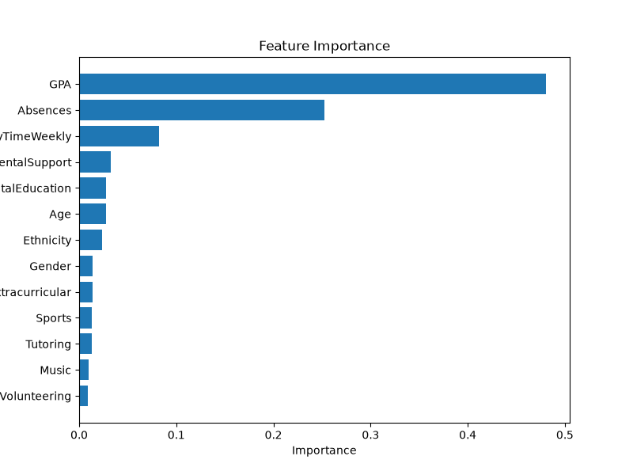

# 🎓 AI-Driven Student Performance Prediction System

## 📌 Project Overview

The **AI-Driven Student Performance Prediction System** is a machine learning project that predicts a student's academic performance based on various factors such as attendance, study hours, previous marks, assignment completion, and other academic indicators.

This project is being developed as part of the **PBEL AI Internship 2026 (IBM)**.

---

## 🎯 Objectives

* Predict student academic performance using Machine Learning.
* Analyze the factors that influence student success.
* Build an AI model capable of making performance predictions.
* Deploy and demonstrate the project using IBM Cloud technologies (if required).

---

## 🛠️ Technologies Used

* Python
* Pandas
* NumPy
* Scikit-learn
* Matplotlib
* IBM Cloud
* Git & GitHub

---

## 📂 Project Structure

```text
Student-Performance-Prediction/
│
├── dataset/
├── notebooks/
├── src/
├── models/
├── README.md
├── requirements.txt
└── app.py
```

---

## 🚀 Features

* Data preprocessing
* Exploratory Data Analysis (EDA)
* Machine Learning model training
* Student performance prediction
* Model evaluation
* Visualization of results

---

## 📊 Expected Input

* Attendance
* Study Hours
* Previous Marks
* Assignment Completion
* Class Participation
* Other academic factors

---

## 📈 Expected Output

* Predicted Marks

or

* Performance Category

  * Excellent
  * Good
  * Average
  * Needs Improvement

---

## 📅 Development Timeline

* Dataset Collection
* Data Preprocessing
* Model Training
* Model Evaluation
* IBM Cloud Integration
* Final Testing
* Project Submission


## Feature Importance



---

## 👩‍💻 Author

**Arshpreet Kaur**

PBEL AI Internship 2026
